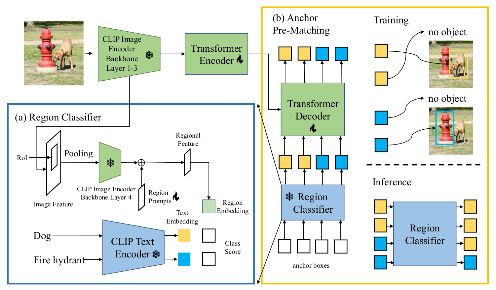

# CORA: Adapting CLIP for Open-Vocabulary Detection with Region Prompting and Anchor Pre-Matching

This is the official PyTorch implementation of CORA (CVPR 2023).

[**Paper**](https://arxiv.org/abs/2303.13076)

> **CORA: Adapting CLIP for Open-Vocabulary Detection with Region Prompting and Anchor Pre-Matching (CVPR 2023)** <br>
> [Xiaoshi Wu](https://github.com/tgxs002), [Feng Zhu](https://zhufengx.github.io/), [Rui Zhao](https://scholar.google.com/citations?user=1c9oQNMAAAAJ&hl=en), [Hongsheng Li](https://www.ee.cuhk.edu.hk/~hsli/) <br>

<p align="center">

</p>

## Overview

We propose CORA, a DETR-style framework for open-vocabulary detection (OVD) that adapts **C**LIP for **O**pen-vocabulary detection by **R**egion prompting and **A**nchor pre-matching. Our method demonstrates **state-of-the-art** results on both COCO and LVIS OVD benchmarks.

## Outline

1. [Environment](#environment)
2. [Datasets](#data-preparation)
3. [Model Zoo](#model-zoo)
4. [Evaluation](#evaluation)
5. [Training Localizer](#training-localizer)
8. [Citation and Acknowledgement](#citation-and-acknowledgement)

## Environment

### Requirements
- Linux with Python ≥ 3.9.12
- CUDA 11
- The provided environment is suggested for reproducing our results, similar configurations may also work.

### Quick Start
```
# environment
conda create -n cora python=3.9.12
conda activate cora
conda install pytorch==1.12.0 torchvision==0.13.0 cudatoolkit=11.3 -c pytorch

# cora
git clone git@github.com:tgxs002/CORA.git
cd CORA

# other dependencies
pip install -r requirements.txt

# install detectron2
Please install detectron2 as instructed in the official tutorial (https://detectron2.readthedocs.io/en/latest/tutorials/install.html). We use version==0.6 in our experiments.

```


## Data Preparation

Check [`docs/dataset.md`](docs/dataset.md) for dataset preparation.

Besides the dataset, we also provide necessary files to reproduce our result. Please download the [learned region prompts](https://drive.google.com/drive/folders/17mi8O1YW6dl8TRkwectHRoC8xbK5sLMw?usp=sharing), and put them under `logs` folder. A guide for training the region prompts is provided in [Region Prompting](#region-prompting).

## Model Zoo

|         Method        |   Pretraining Model  | Novel |  All  | Checkpoint |
|-----------------------|----------------------|-------|-------|------------|
|         CORA          |          RN50        |  35.1 |  35.4 |  [Checkpoint](https://drive.google.com/file/d/1lQmFrbfaZutlA72gi-VOAHOvGuHSYMbo/view?usp=share_link)|
|         CORA          |         RN50x4       |  41.7 |  43.8 |  [Checkpoint](https://drive.google.com/file/d/115osjVyv86vjG_b0W83vPQryXxdIDsv_/view?usp=share_link)|

Checkpoints for LVIS, $\text{CORA}^+$ will be ready soon.

## Evaluation
Run the following command for evaluating the RN50 model:
```
# if you are running locally
bash configs/COCO/R50_dab_ovd_3enc_apm128_splcls0.2_relabel_noinit.sh test 8 local --resume /path/to/checkpoint.pth --eval

# if you are running on a cluster with slurm scheduler
bash configs/COCO/R50_dab_ovd_3enc_apm128_splcls0.2_relabel_noinit.sh test 8 slurm quota_type partition_name --resume /path/to/checkpoint.pth --eval

```
If you are using slurm, please remember to replace quota_type and partition_name to your quota type and the partition you are using.
You can directly change the config and checkpoint path to evaluate other models.

## Training Localizer

Before training the localizer, please make sure that the region prompts and relabeled annotations as instructed in [Data Preparation](#data-preparation).

Run the following command to train the RN50 model:
```
# if you are running locally
bash configs/COCO/R50_dab_ovd_3enc_apm128_splcls0.2_relabel_noinit.sh RN50 8 local

# if you are running on a cluster with slurm scheduler
bash configs/COCO/R50_dab_ovd_3enc_apm128_splcls0.2_relabel_noinit.sh RN50 8 slurm quota_type partition_name
```
If you are using slurm, please remember to replace quota_type and partition_name to your quota type and the partition you are using.
You can directly change the config to train other models.

### Region Prompting
We provide the trained pre-trained region prompts as specified in [Data Preparation](#data-preparation).
Please refer to the region branch for training and exporting the region prompts.
```shell
git checkout region
```

### CLIP-Aligned Labeling
The code for CLIP-Aligned Labeling will be released soon in another branch of this repository, we provide the pre-computed relabeled annotations as specified in [Data Preparation](#data-preparation).

## Citation and Acknowledgement

### Citation

If you find this repo useful, please consider citing our paper:

<!-- ```
@inproceedings{wu2023cora,
  title={CORA: Adapting CLIP for Open-Vocabulary Detection with Region Prompting and Anchor Pre-Matching},
  author={Xiaoshi Wu and Feng Zhu and Rui Zhao and Hongsheng Li},
  booktitle={Proceedings of the IEEE/CVF Conference on Computer Vision and Pattern Recognition (CVPR)},
  pages={TBD--TBD},
  year={2023}
}
``` -->

```
@article{wu2023cora,
  title={CORA: Adapting CLIP for Open-Vocabulary Detection with Region Prompting and Anchor Pre-Matching},
  author={Xiaoshi Wu and Feng Zhu and Rui Zhao and Hongsheng Li},
  journal={ArXiv},
  year={2023},
  volume={abs/2303.13076}
}
```

### Acknowledgement

This repository was built on top of [SAM-DETR](https://github.com/ZhangGongjie/SAM-DETR), [CLIP](https://github.com/openai/CLIP), [RegionClip](https://github.com/microsoft/RegionCLIP), and [DAB-DETR](https://github.com/IDEA-Research/DAB-DETR). We thank the effort from the community.